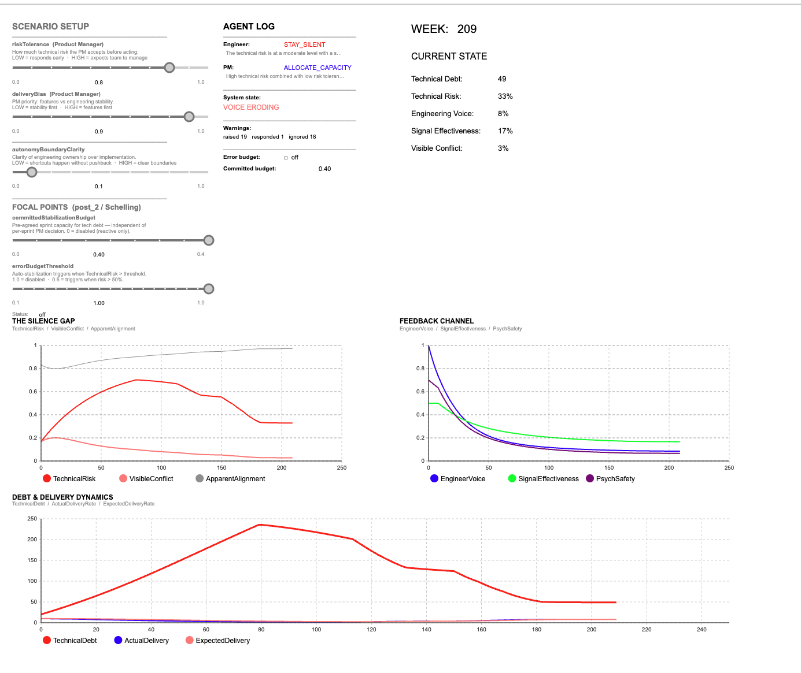
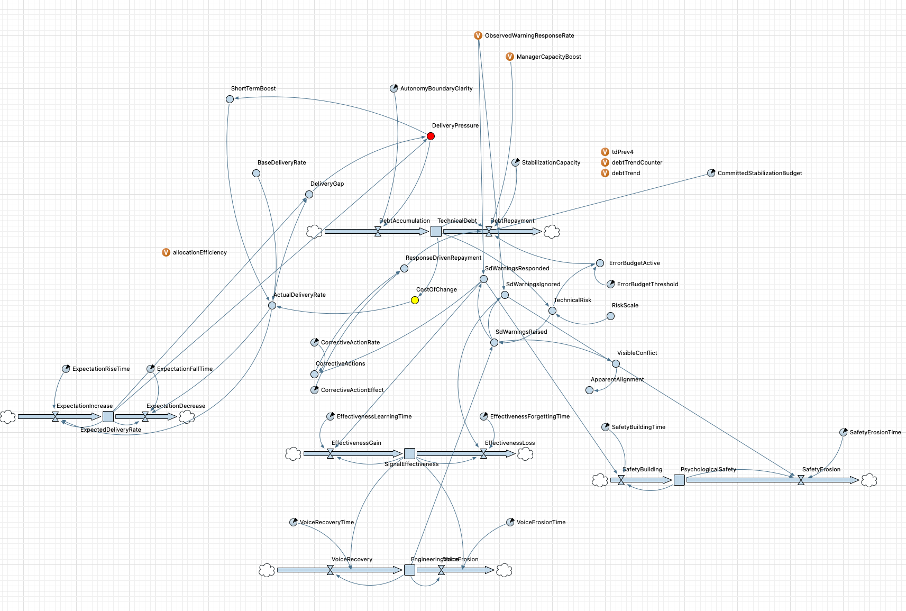
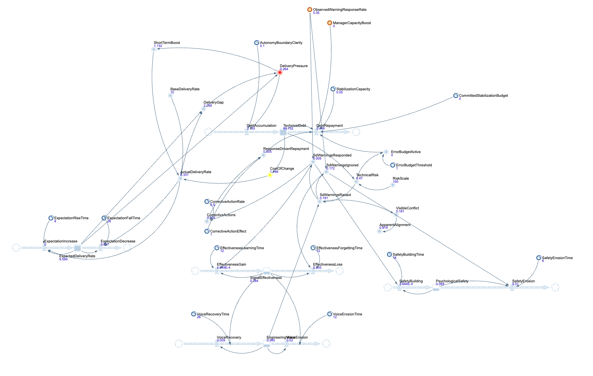

# Engineering Conflict Model

A hybrid System Dynamics + agent-based simulation of engineering feedback degradation under delivery pressure, built in AnyLogic 8.9.9.

> **Core question:** Can an organization appear increasingly aligned while its underlying technical risk is getting worse?

The model operationalizes the central hypothesis behind the *Engineering Decisions* articles:

> *There is a fundamental difference between "we have nothing to argue about" and "we no longer see the point in arguing."*

It is an **exploratory/explanatory simulation**, not a predictive model of real engineering organizations. Its normalized variables and coefficients are model constructs, not empirically estimated organizational measurements.

---

## Screenshots

### Simulation UI



Example run with a strongly delivery-oriented Product Manager (`riskTolerance=0.8`, `deliveryBias=0.9`) and low autonomy-boundary clarity (`0.1`). The UI separates underlying technical state from observable conflict and exposes the health of the engineering feedback channel.

### System Dynamics diagram



The stock-and-flow model connects delivery expectations, delivery pressure, technical debt, technical risk, warning behavior, management response, engineering voice, signal effectiveness, psychological safety, and stabilization capacity.

### System Dynamics diagram during a run



The same structure with live simulation values.

---

## What the Model Simulates

The model combines:

- **System Dynamics** for continuous stocks, flows, delays, and feedback loops;
- **agent-based modeling** for an `EngineerAgent` and a `ProductManagerAgent`;
- **LLM-driven behavioral policies** for context-sensitive discrete decisions;
- **governance mechanisms** that can constrain or moderate discretionary management behavior.

The main causal path is:

```text
delivery expectations
        |
        v
delivery pressure
        |
        +--------------------------+
        |                          |
        v                          v
technical debt               PM decision context
        |                          |
        v                          v
technical risk ---> engineer warning ---> PM response
                                         |
                    +--------------------+-------------------+
                    |                    |                   |
                    v                    v                   v
             signal effectiveness  psychological safety  stabilization
                    |                    |                   |
                    +---------+----------+                   |
                              v                              v
                       engineering voice               debt repayment
                              |
                              v
                       visible conflict
```

The model is designed to allow `TechnicalRisk` and `VisibleConflict` to diverge. Low visible conflict therefore does **not** automatically imply a healthy engineering system.

---

## Theoretical Basis

The model draws on several bodies of work:

| Reference | Role in the model |
|---|---|
| Thomas C. Schelling, *The Strategy of Conflict* (1960) | Mixed-motive framing and focal-point interpretation |
| Donella H. Meadows, *Thinking in Systems* (2008) | Stocks, flows, delays, and feedback-loop methodology |
| Repenning & Sterman (2001, 2002) | Capability traps, firefighting, and self-reinforcing operational pressure |
| Amy C. Edmondson (1999) | Psychological safety as a construct distinct from signal effectiveness |
| Hirschman, *Exit, Voice, and Loyalty* (1970) | Voice as an organizational response mechanism |
| Rahmandad, Repenning & Sterman (2009) | Feedback delay and organizational learning |

These sources motivate the conceptual structure. They do **not** provide empirical estimates for the numerical coefficients used in this implementation.

---

## Model Architecture

### Agents

| Agent | Role | Main traits |
|---|---|---|
| `EngineerAgent` | Interprets technical risk and decides whether/how strongly to raise a concern | `riskTolerance`, `assertiveness`, `seniority` |
| `ProductManagerAgent` | Responds to engineering warnings while balancing delivery and technical risk | `riskTolerance`, `deliveryBias` |

Engineer actions:

```text
STAY_SILENT
RAISE_WARNING
ESCALATE
```

Product Manager actions:

```text
DEFER
ACKNOWLEDGE
ALLOCATE_CAPACITY
```

`ESCALATE` represents a stronger warning path in the current model; it is not a full multi-level organizational escalation hierarchy.

### Why use an LLM?

The LLM is used as a **behavioral policy provider**:

```text
system state + traits + interaction history -> discrete action
```

It allows decisions to depend on combinations of context without hard-coding a complete decision table.

The LLM is **not structurally required**. The same architecture could use deterministic rules, probabilistic policies, empirical classifiers, or human-in-the-loop decisions instead.

---

## System Dynamics Stocks

| Stock | Initial value | Interpretation |
|---|---:|---|
| `TechnicalDebt` | 20 | Accumulated technical compromises |
| `ExpectedDeliveryRate` | 10 | Management delivery expectations |
| `EngineeringVoice` | 1.0 | Modeled willingness/capacity for engineering concerns to surface |
| `SignalEffectiveness` | 0.5 | Modeled expectation that raising a concern can affect decisions |
| `PsychologicalSafety` | 0.7 | Modeled safety to speak up |

All values such as `EngineeringVoice`, `SignalEffectiveness`, `PsychologicalSafety`, `VisibleConflict`, and `TechnicalRisk` are **normalized simulation constructs**. For example, `PsychologicalSafety = 0.7` is not a psychometric survey score, and `TechnicalRisk = 0.6` is not a 60% probability of an incident.

---

## Important Derived Variables

| Variable | Interpretation |
|---|---|
| `TechnicalRisk` | Normalized risk derived from accumulated technical debt |
| `VisibleConflict` | Observable manifestation of engineering disagreement/feedback |
| `ApparentAlignment` | Apparent absence of visible conflict; not equivalent to actual organizational health |
| `ObservedWarningResponseRate` | Observed effectiveness of management responses to warnings |
| `DeliveryPressure` | Pressure created by the gap between expected and actual delivery |
| `ManagerCapacityBoost` | Additional stabilization capacity created by PM decisions |
| `ActualDeliveryRate` | Current modeled delivery rate |
| `DeliveryGap` | Difference between expected and actual delivery |

---

## Key Feedback Mechanisms

The implementation contains several interacting loops. The most important conceptual mechanisms are:

### Debt / delivery-pressure trap

```text
delivery pressure
-> short-term optimization / debt accumulation
-> technical debt
-> delivery degradation
-> delivery gap
-> more delivery pressure
```

### Warning-response balancing loop

```text
technical risk
-> engineering warning
-> PM response
-> stabilization capacity
-> debt repayment
-> lower technical risk
```

### Voice-erosion loop

```text
ineffective or deferred warnings
-> lower signal effectiveness
-> weaker engineering voice
-> fewer warnings
-> less corrective intervention
```

### Psychological-safety loop

```text
ignored warnings
-> psychological safety erodes
-> willingness to speak decreases
-> fewer warnings surface
```

### Expectation ratchet

```text
higher short-term delivery
-> delivery expectations rise
-> future delivery gap/pressure can increase
```

These loops are modeling assumptions. The simulation is used to study the trajectories and interaction effects that emerge when they operate together.

---

## Governance / Focal-Point Mechanisms

The current model includes three structural interventions.

| Parameter | Default | Meaning |
|---|---:|---|
| `CommittedStabilizationBudget` | `0.0` | Pre-committed capacity for stabilization/technical debt, independent of per-warning PM discretion |
| `ErrorBudgetThreshold` | `1.0` | Threshold above which automatic stabilization can activate; `1.0` effectively disables it for normal runs |
| `AutonomyBoundaryClarity` | `0.5` | Clarity of engineering decision boundaries; lower values increase exposure to delivery-driven shortcuts |

These mechanisms represent governance rules rather than individual personality.

They allow the model to test a second question:

> Can structural commitments and clear decision boundaries prevent or reduce feedback degradation under strong delivery pressure?

---

## Assumptions vs. Emergent Outcomes

This distinction is essential when interpreting the model.

### Encoded assumptions

Examples include:

- technical debt contributes to technical risk;
- delivery pressure can increase debt accumulation;
- repeated ineffective responses can reduce future engineering voice;
- ignored warnings can erode psychological safety;
- allocated stabilization capacity increases debt repayment;
- delivery performance can change future delivery expectations;
- governance mechanisms can constrain otherwise discretionary behavior.

These relationships are part of the model design. The simulation does not "discover" them.

### Emergent outcomes

Questions that are meaningfully explored by running the model include:

- Can technical risk rise while visible conflict falls?
- Can repeated deferral create a persistent low-voice organizational regime?
- Do different PM response traits lead to different long-run trajectories?
- Can a committed stabilization budget prevent a debt/feedback trap?
- Does an error-budget threshold create a different equilibrium?
- How strongly does autonomy-boundary clarity moderate delivery pressure?
- Which outcomes remain stable across repeated stochastic LLM runs?

Simulation results support claims **about this model under specified assumptions and parameters**, not causal claims about real organizations without external validation.

---

## Running the Model

### Requirements

- **AnyLogic 8.9.9** (Personal Learning Edition or higher)
- A supported LLM provider:
  - **Google Gemini**, or
  - **Ollama** for local inference

### Gemini setup

1. Obtain an API key from [Google AI Studio](https://aistudio.google.com/app/apikey).
2. Open the model in AnyLogic.
3. Set `geminiApiKey` in the model variables.

The model can also read `GEMINI_API_KEY` from the environment when the model variable is empty.

### Ollama

Set:

```text
llmProvider = "OLLAMA"
```

and configure `llmEndpoint` for the local Ollama server.

### LLM configuration

The current model exposes `llmModel` and provider configuration in the model. Record the provider, exact model, and generation settings when publishing experiment results: LLM behavior can change between models and versions.

---

## Baseline Scenarios

Configure the scenario before running the simulation.

| Parameter | A — responsive | B — neutral | C — delivery-oriented |
|---|---:|---:|---:|
| PM `riskTolerance` | 0.2 | 0.5 | 0.8 |
| PM `deliveryBias` | 0.2 | 0.5 | 0.8 |
| `AutonomyBoundaryClarity` | 0.5 | 0.5 | 0.5 |
| `CommittedStabilizationBudget` | 0.0 | 0.0 | 0.0 |
| `ErrorBudgetThreshold` | 1.0 | 1.0 | 1.0 |

The baseline scenarios are deliberately stylized. Values such as `0.2`, `0.5`, and `0.8` are experimental settings, not calibrated real-world personality scores.

---

## Governance Sensitivity Scenarios

Example structural tests:

| Scenario | PM risk tolerance | PM delivery bias | CSB | EBT | ABC | Purpose |
|---|---:|---:|---:|---:|---:|---|
| High baseline | 0.8 | 0.8 | 0.0 | 1.0 | 0.5 | Delivery-oriented baseline |
| High + CSB | 0.8 | 0.8 | 0.2 | 1.0 | 0.5 | Pre-committed stabilization capacity |
| High + EBT | 0.8 | 0.8 | 0.0 | 0.5 | 0.5 | Automatic risk threshold |
| High + clear boundaries | 0.8 | 0.8 | 0.0 | 1.0 | 0.9 | Engineering autonomy boundary |
| Neutral + unclear boundaries | 0.5 | 0.5 | 0.0 | 1.0 | 0.1 | Boundary-violation sensitivity |

Where:

```text
CSB = CommittedStabilizationBudget
EBT = ErrorBudgetThreshold
ABC = AutonomyBoundaryClarity
```

For stochastic LLM scenarios, run multiple replications rather than interpreting a single trajectory as representative.

---

## Reading the UI

### The Silence Gap

The primary plot compares:

- `TechnicalRisk`
- `VisibleConflict`
- `ApparentAlignment`

A widening gap between technical risk and visible conflict is the model's central observable phenomenon.

### Feedback Channel

Tracks:

- `EngineeringVoice`
- `SignalEffectiveness`
- `PsychologicalSafety`

These are related but distinct constructs:

```text
SignalEffectiveness = does speaking appear to influence decisions?
PsychologicalSafety = does speaking feel safe?
EngineeringVoice    = how strongly engineering concerns actually surface?
```

### Debt & Delivery Dynamics

Tracks:

- `TechnicalDebt`
- `ActualDeliveryRate`
- `ExpectedDeliveryRate`

This exposes the interaction between short-term delivery pressure and longer-term technical consequences.

---

## Interpreting Results

Do **not** interpret normalized values literally.

Incorrect:

> `TechnicalRisk = 0.7` means a 70% chance of system failure.

Correct:

> Within the model's normalized risk scale, the scenario reached a substantially higher technical-risk state than the comparison scenario.

Incorrect:

> `ApparentAlignment = 0.93` means the real organization is 93% aligned.

Correct:

> The model shows very low visible conflict despite high underlying technical risk.

Likewise, differences between scenarios should be reported with the full parameter configuration and multiple runs.

---

## Current Experimental Findings

Experiments performed during development indicate several recurring behaviors in the current model configuration:

1. **Visible conflict can fall while technical risk remains high or rises.**
2. **Strong delivery-oriented response regimes can degrade signal effectiveness, psychological safety, and engineering voice.**
3. **Pre-committed stabilization capacity can materially change the trajectory even when PM traits remain delivery-oriented.**
4. **Risk-triggered stabilization can constrain technical debt around a threshold-dependent equilibrium.**
5. **Autonomy-boundary clarity can materially moderate debt accumulation under delivery pressure.**

These are **simulation findings**, not empirical findings about real organizations.

Exact numerical results depend on model version, scenario parameters, LLM provider/model, and stochastic runs. For that reason this README intentionally avoids presenting development-run numbers as universal constants.

---

## Validation Status

The model has undergone several forms of internal validation during development:

### Behavioral checks

The Engineer and Product Manager LLM policies were tested across combinations of:

- technical risk;
- risk tolerance;
- assertiveness / delivery bias;
- warning history;
- response history.

The purpose was to verify action-space coverage and directional sensitivity, not to claim empirical human-behavior calibration.

### Repeated runs

Baseline and governance scenarios have been executed repeatedly to distinguish stable model regimes from single stochastic LLM trajectories.

### Sensitivity analysis

Governance parameters such as:

- `CommittedStabilizationBudget`;
- `ErrorBudgetThreshold`;
- `AutonomyBoundaryClarity`

are varied independently and in combination to test whether headline outcomes are robust to structural interventions.

### Not yet validated

The model has **not** been externally validated against longitudinal data from real engineering organizations.

Therefore it should not be used as:

- a forecasting model;
- a personnel assessment tool;
- a quantitative risk calculator;
- evidence that a particular real-world management style will produce a specific numerical outcome.

---

## Known Limitations

The model intentionally simplifies a much larger sociotechnical system.

Current limitations include:

- Product–Engineering interaction is represented through a Product Manager response agent and delivery-pressure dynamics rather than a complete bargaining model.
- There are no explicit utility functions, reservation points, or negotiated settlements in the Schelling/game-theoretic sense.
- `ESCALATE` is a stronger warning path, not a complete multi-level organizational escalation hierarchy.
- Engineer exit/attrition is not modeled.
- PM traits do not currently drift endogenously over time.
- Psychological safety is a normalized simulation construct, not a validated psychometric measurement.
- Technical risk is a normalized state variable, not an empirical probability of failure.
- Several coefficients and time constants are modeling assumptions and require external calibration for empirical use.
- LLM policies introduce provider/model dependence and stochasticity.
- AnyLogic is required to execute the native model.

---

## Model Scope

The intended scope is:

> **Simulation of engineering feedback degradation under different delivery-pressure, management-response, and governance conditions.**

The model is **not** intended as a complete simulation of Product–Engineering conflict.

In particular, it does not attempt to fully model:

- product strategy formation;
- all tactics-vs-strategy conflicts;
- formal bargaining utilities;
- organizational politics;
- employee exit;
- compensation or performance systems;
- the full hierarchy of escalation.

---

## Relationship to the Engineering Decisions Articles

The articles provide the broader sociotechnical argument. The simulation operationalizes one narrower hypothesis as an executable model:

```text
repeated ineffective engineering feedback
        ->
weaker feedback channel
        ->
less visible disagreement

while

technical risk may remain high or continue to grow
```

The model should therefore be understood as a **formal exploration of a mechanism**, not as proof of the article's thesis.

---

## Reproducibility Checklist

When reporting an experiment, record at minimum:

- repository/model version or commit;
- AnyLogic version;
- simulation horizon;
- number of runs;
- PM `riskTolerance`;
- PM `deliveryBias`;
- `CommittedStabilizationBudget`;
- `ErrorBudgetThreshold`;
- `AutonomyBoundaryClarity`;
- LLM provider;
- exact LLM model;
- generation settings such as temperature;
- any manual changes to model coefficients.

For LLM-driven experiments, a single run is insufficient for robust comparison.

---

## Suggested Repository Structure

```text
EngineeringConflictModel/
├── EngineeringConflictModel.alp
├── README.md
├── RESEARCH.md
├── screenshots/
│   ├── screenshot-ui.png
│   ├── screenshot-sd-diagram.png
│   └── screenshot-sd-running.png
├── experiments/
│   ├── baseline/
│   └── sensitivity/
└── results/
```

Git history should be used for model versions rather than keeping timestamped model copies in the repository root.

---

## References

- Schelling, T. C. (1960). *The Strategy of Conflict*. Harvard University Press.
- Meadows, D. H. (2008). *Thinking in Systems: A Primer*. Chelsea Green Publishing.

---

## License

Add the repository's actual license here once a `LICENSE` file is included. Do not assume a license from repository visibility alone.
